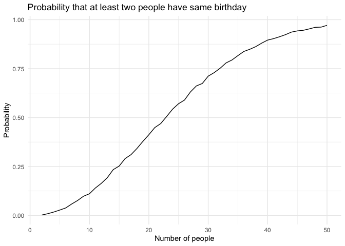
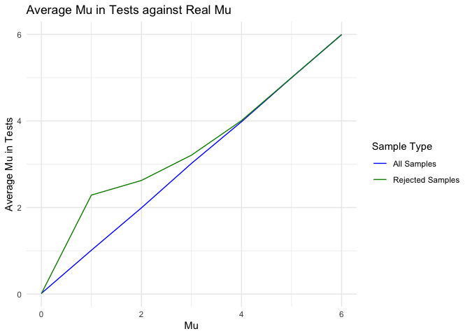

Homework 5
================
David
2024-11-09

## Problem 1

Suppose you put n people in a room, and want to know the probability
that at least two people share a birthday. For simplicity, we’ll assume
there are no leap years and that birthdays are uniformly distributed
over the year. Write a function that, for a fixed group size, randomly
draws “birthdays” for each person; checks whether there are duplicate
birthdays in the group; and returns TRUE or FALSE based on the result.

``` r
bdays_sim = function(n) {

  bdays = sample(1:365, size = n, replace = TRUE)

  duplicate = length(unique(bdays)) < n
  
  return(duplicate)

}
```

Next, run this function 10000 times for each group size between 2 and
50. For each group size, compute the probability that at least two
people in the group will share a birthday by averaging across the 10000
simulation runs. Make a plot showing the probability as a function of
group size, and comment on your results.

``` r
sim_res =
  expand_grid(
    n = 2:50,
    iter = 1:10000
  ) |>
  mutate(res = map_lgl(n, bdays_sim)) |>
  group_by(n) |>
  summarise(prob = mean(res))

sim_res |>
  ggplot(aes(x = n, y = prob)) +
  geom_line() +
  theme_minimal() +
  labs(
    title =  "Probability that at least two people have same birthday",
    x = "Number of people",
    y = "Probability"
  )
```

<!-- -->

Probability of two people having same day of birthday gradually
increases as number of people increase. With the speed of increase going
up from 2 to around 25 and going down with number of people greater than
25. Probability eventually reaches close to 1.00 .

## Problem 2

``` r
norm_test = function(mu) {
  
  norm_distribution = rnorm(30, mean = mu, sd = 5)
  
  table =
    t.test(norm_distribution, mu = 0) |>
    broom::tidy()
  
  return(table)
}

norm_sim =
  expand_grid(
    mu = 0:6,
    iter = 1:5000
  ) |>
  mutate(stat_table = map(mu, norm_test)) |>
  unnest(stat_table) |>
  janitor::clean_names() |>
  select(mu:conf_low) 
```

Make a plot showing the proportion of times the null was rejected (the
power of the test) on the y axis and the true value of mu on the x axis.

``` r
norm_sim |>
  mutate(
    h = case_when(
      p_value < 0.05 ~ 1,
      p_value >= 0.05 ~ 0
    )
  ) |>
  group_by(mu) |>
  summarise(prob = sum(h) / 5000) |>
  ggplot(aes(x = mu, y = prob)) +
  geom_line() +
  theme_minimal() +
  labs(
    title = "Probability of Rejecting H0 Hypothesis in t Test",
    x = "Mu",
    y = "Probability"
  )
```

<!-- -->

As effect size increases, the power of the test also increases. This is
because larger effect sizes create more distinct differences or stronger
associations, making it easier for statistical tests to detect them. For
instance, in a study with a small sample size, a large effect size may
still yield high power, while a small effect size may result in low
power, risking the failure to detect a true effect.

Make a plot showing average estimate of mu on y axis and true mu on x
axis. Add another layer shwoing the average estimate of mu only in
samples for which the null hypothesis was rejected.

``` r
norm_sim |>
  group_by(mu) |>
  summarise(
    mu_mean_all = mean(estimate),
    mu_mean_1 = mean(estimate[p_value < 0.05])
  ) |>
  ggplot(aes(x = mu)) +
  geom_line(aes(y = mu_mean_all, color = "All Samples")) +
  geom_line(aes(y = mu_mean_1, color = "Rejected Samples")) +
  theme_minimal() +
  labs(
    title = "Average Mu in Tests against Real Mu",
    x = "Mu",
    y = "Average Mu in Tests"
  ) +
  scale_color_manual(
    name = "Sample Type",
    values = c("All Samples" = "blue", "Rejected Samples" = "green4"),
    labels = c("All Samples", "Rejected Samples")
  )
```

<!-- -->

Across tests where the null hypothesis is rejected, the sample average
of mu is often greater than the true value of mu due to selection bias.
Only samples with larger estimates of mu are likely to achieve
statistical significance, especially for smaller values of mu. This
leads to an inflated average estimate in the subset of rejected tests,
which does not accurately reflect the true mu.

## Problem 3

``` r
homicide = read_csv("homicide-data.csv") |>
  janitor::clean_names()
```

    ## Rows: 52179 Columns: 12
    ## ── Column specification ────────────────────────────────────────────────────────
    ## Delimiter: ","
    ## chr (9): uid, victim_last, victim_first, victim_race, victim_age, victim_sex...
    ## dbl (3): reported_date, lat, lon
    ## 
    ## ℹ Use `spec()` to retrieve the full column specification for this data.
    ## ℹ Specify the column types or set `show_col_types = FALSE` to quiet this message.

The dataset has 52179 observation and 12 variables, including report
date, victim information, location of homicide and disposition status.

``` r
homicide =
  homicide |>
  mutate(city_state = paste(city, state, sep = ",")) |>
  group_by(city_state) |>
  summarise(
    total = n(),
    unsolved = sum(disposition %in% c("Closed without arrest", "Open/No arrest"))
  )
```

Function of prop.test used in below chart and plot. (applied
**broom::tidy()** here instead of below code chunks)

``` r
test = function(unsolved, total){
  
  table =
    prop.test(unsolved, total, p = NULL, alternative = "two.sided", conf.level = 0.95, correct = TRUE) |>
    broom::tidy() |>
    select(estimate, conf.low, conf.high)
  
  return(table)
}
```

For the city of Baltimore, MD, estimate the proportion of homicides that
are unsolved; save the output as an R object, pull the estimated
proportion and confidence intervals from the resulting tidy dataframe.

``` r
homicide |>
  filter(city_state == "Baltimore,MD") |>
  mutate(table = map2(unsolved, total, \(x, y) test(unsolved = x, total = y))) |>
  pull(table) |>
  knitr::kable(
    col.names = c("Estimate", "Lower limit of 95% CI", "Upper limit of 95% CI")
  )
```

<table class="kable_wrapper">
<tbody>
<tr>
<td>

|  Estimate | Lower limit of 95% CI | Upper limit of 95% CI |
|----------:|----------------------:|----------------------:|
| 0.6455607 |             0.6275625 |             0.6631599 |

</td>
</tr>
</tbody>
</table>

Now for each of the cities in your dataset, and extract both the
proportion of unsolved homicides and the confidence interval for each.
List columns and unnest as necessary to create a tidy dataframe with
estimated proportions and CIs for each city.

``` r
homicide =
  homicide |>
  group_by(city_state) |>
  summarise(table = map2(unsolved, total, \(x, y) test(unsolved = x, total = y))) |>
  unnest(table) |>
  mutate(
    estimate = round(estimate, 3),
    conf.low = round(conf.low, 3),
    conf.high = round(conf.high, 3),
    CI = paste(conf.low, conf.high, sep = ",")
  )
```

    ## Warning: There was 1 warning in `summarise()`.
    ## ℹ In argument: `table = map2(unsolved, total, function(x, y) test(unsolved = x,
    ##   total = y))`.
    ## ℹ In group 49: `city_state = "Tulsa,AL"`.
    ## Caused by warning in `prop.test()`:
    ## ! Chi-squared approximation may be incorrect

``` r
homicide |>
  select(-conf.low, -conf.high) |>
  knitr::kable(
    col.names = c("City, State", "Estimate", "95% CI")
  )
```

| City, State       | Estimate | 95% CI      |
|:------------------|---------:|:------------|
| Albuquerque,NM    |    0.386 | 0.337,0.438 |
| Atlanta,GA        |    0.383 | 0.353,0.415 |
| Baltimore,MD      |    0.646 | 0.628,0.663 |
| Baton Rouge,LA    |    0.462 | 0.414,0.511 |
| Birmingham,AL     |    0.434 | 0.399,0.469 |
| Boston,MA         |    0.505 | 0.465,0.545 |
| Buffalo,NY        |    0.612 | 0.569,0.654 |
| Charlotte,NC      |    0.300 | 0.266,0.336 |
| Chicago,IL        |    0.736 | 0.724,0.747 |
| Cincinnati,OH     |    0.445 | 0.408,0.483 |
| Columbus,OH       |    0.530 | 0.5,0.56    |
| Dallas,TX         |    0.481 | 0.456,0.506 |
| Denver,CO         |    0.542 | 0.485,0.598 |
| Detroit,MI        |    0.588 | 0.569,0.608 |
| Durham,NC         |    0.366 | 0.31,0.426  |
| Fort Worth,TX     |    0.464 | 0.422,0.507 |
| Fresno,CA         |    0.347 | 0.305,0.391 |
| Houston,TX        |    0.507 | 0.489,0.526 |
| Indianapolis,IN   |    0.449 | 0.422,0.477 |
| Jacksonville,FL   |    0.511 | 0.482,0.54  |
| Kansas City,MO    |    0.408 | 0.38,0.437  |
| Las Vegas,NV      |    0.414 | 0.388,0.441 |
| Long Beach,CA     |    0.413 | 0.363,0.464 |
| Los Angeles,CA    |    0.490 | 0.469,0.511 |
| Louisville,KY     |    0.453 | 0.412,0.495 |
| Memphis,TN        |    0.319 | 0.296,0.343 |
| Miami,FL          |    0.605 | 0.569,0.64  |
| Milwaukee,wI      |    0.361 | 0.333,0.391 |
| Minneapolis,MN    |    0.511 | 0.459,0.563 |
| Nashville,TN      |    0.362 | 0.329,0.398 |
| New Orleans,LA    |    0.649 | 0.623,0.673 |
| New York,NY       |    0.388 | 0.349,0.427 |
| Oakland,CA        |    0.536 | 0.504,0.569 |
| Oklahoma City,OK  |    0.485 | 0.447,0.524 |
| Omaha,NE          |    0.413 | 0.365,0.463 |
| Philadelphia,PA   |    0.448 | 0.43,0.466  |
| Phoenix,AZ        |    0.551 | 0.518,0.584 |
| Pittsburgh,PA     |    0.534 | 0.494,0.573 |
| Richmond,VA       |    0.263 | 0.223,0.308 |
| Sacramento,CA     |    0.370 | 0.321,0.421 |
| San Antonio,TX    |    0.429 | 0.395,0.463 |
| San Bernardino,CA |    0.618 | 0.558,0.675 |
| San Diego,CA      |    0.380 | 0.335,0.426 |
| San Francisco,CA  |    0.507 | 0.468,0.545 |
| Savannah,GA       |    0.467 | 0.404,0.532 |
| St. Louis,MO      |    0.540 | 0.515,0.564 |
| Stockton,CA       |    0.599 | 0.552,0.645 |
| Tampa,FL          |    0.457 | 0.388,0.527 |
| Tulsa,AL          |    0.000 | 0,0.945     |
| Tulsa,OK          |    0.331 | 0.293,0.371 |
| Washington,DC     |    0.438 | 0.411,0.465 |

**Tulsa,AL only has one case so the estimate might not be correct.**

Create a plot that shows the estimates and CIs for each city – check out
geom_errorbar for a way to add error bars based on the upper and lower
limits. Organize cities according to the proportion of unsolved
homicides.

``` r
homicide |>
  ggplot(aes(x = fct_reorder(city_state, estimate), y = estimate)) +
  geom_point(color = "blue") +
  geom_errorbar(aes(ymin = conf.low, ymax = conf.high), width = 0.2, color = "black") +
  coord_flip() +
  labs(
    title = "Proportion of Unsolved Homicides by City",
    x = "City",
    y = "Estimate of Proportion Unsolved"
  ) +
  theme_minimal()
```

<!-- -->

**Tulsa,AL only has one case so the estimate might not be correct.**
